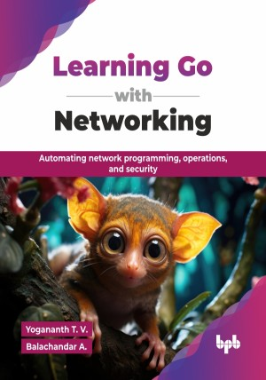

# Learning Go with Networking

Automating network programming, operations, and security.

This is the repository for [Learning Go with Networking
](https://bpbonline.com/products/learning-go-with-networking?variant=44649248719048),published by BPB Publications.

## About the Book
Golang has emerged as a powerful language for networking, known for its efficiency and concurrency, making it ideal for building resilient and scalable network applications. This book is designed to equip networking professionals with the Golang skills needed to navigate this dynamic landscape, providing a practical guide from fundamental concepts to advanced network programming.

This book systematically guides you through Golang's core features, including concurrency, generics, and error handling, before diving into essential networking principles like IP, TCP, and UDP. You will learn to develop applications, design synchronous and asynchronous APIs (with a focus on Ponzu and Keycloak), and effectively handle data using formats like JSON and XML, along with stream processing with AMQP, Kafka, and MQTT. The book explores Golang network packages for protocols such as ARP, FTP, DNS, and raw sockets. It also emphasizes performance optimization, covering I/O, caching, and database techniques, and automation strategies, including device, network, and cloud deployment, along with Cisco DevNet. Security is thoroughly addressed, covering authentication, cryptography (SSL/TLS, asymmetric/symmetric), certificate handling, and OWASP Top 10 vulnerabilities, and the book concludes with an exploration of network penetration testing techniques.

By the end of this book, readers will gain a solid foundation in Golang and its application to networking, enabling them to build efficient, secure, and automated network solutions and understand the security landscape, from defensive best practices to offensive techniques.

## What You Will Learn
• Build scalable backend services using Go and its libraries.

• Understand TCP/UDP networking through real Go-based examples.

• Develop secure APIs with authentication and token handling.

• Automate infrastructure tasks using Golang and DevNet.

• Identify and fix OWASP Top 10 vulnerabilities in Go.

• Perform ethical hacking in a controlled lab environment.

• Optimize Go applications using profiling and performance tools.

• Handle data formats like JSON, XML, and Base64 effectively.

